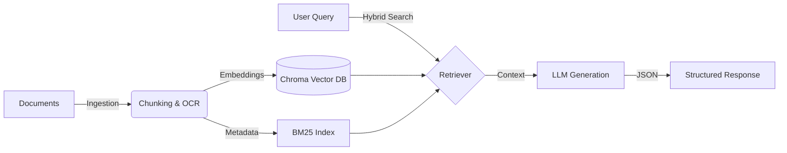
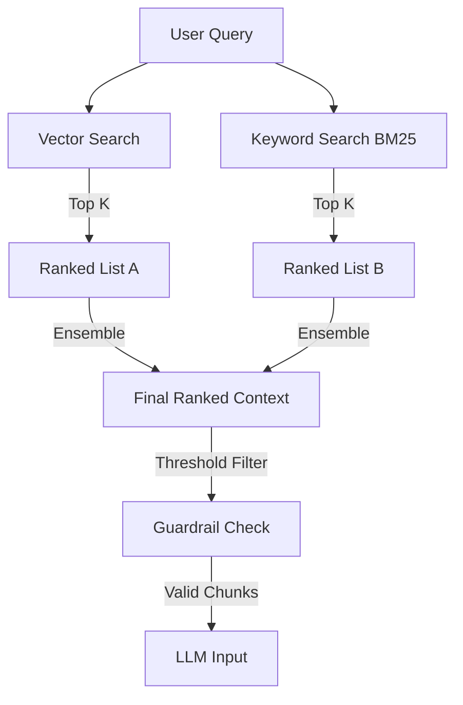

# 🤖 RAG Use Case Generator  

---

## 📌  Overview  

RAG Use Case Generator is an AI-powered product that converts unstructured product documentation (PDFs, Word files, images, and text) into structured, reliable software use cases.

Instead of manually reading through long documents and extracting requirements, users can upload their files and instantly generate accurate flows, validations, and test scenarios grounded strictly in real content.

---

## 🎯 Problem Statement  

Product and engineering teams often work with:

- Scattered documentation across formats  
- Unclear or incomplete requirements  
- Manual effort to convert documents into usable use cases  

Most AI tools generate generic outputs or hallucinate missing details.

This leads to:

❌ Incorrect requirements  
❌ Time wasted on reviews  
❌ Low trust in AI-generated outputs  

---

## ✅ Solution  

RAG Use Case Generator uses a context-grounded AI pipeline that:

- Ingests multi-format documents  
- Retrieves only relevant content for each query  
- Generates structured outputs strictly based on evidence  

This ensures:

✔ Accurate use cases  
✔ Zero hallucination  
✔ Production-ready structured responses  

---

## 👤 Target Users  

- Product Managers  
- QA Engineers  
- Software Engineers  
- Business Analysts  

Anyone working with product documentation and requirements.

---

## 🔄 User Journey  

1. Upload product documents (PDFs, Word files, images, text)  
2. System processes content with text extraction and OCR  
3. Data is indexed into a vector database  
4. User asks for use cases, flows, or validations  
5. Relevant context is retrieved via hybrid search  
6. AI generates grounded structured outputs  
7. Results appear in an interactive UI  

---

## 🧠Highlights  

- Multi-modal document ingestion  
- Hybrid retrieval (semantic + keyword search) for high accuracy  
- Context-grounded RAG pipeline to avoid hallucinations  
- Guardrails for scope enforcement  
- Structured JSON outputs  
- Transparent debugging view for trust  

---

## 🏗️ Architecture

The system follows a modular RAG pipeline:

### High-Level Data Flow

### Context Grounding

### Key Layers  

**1. Ingestion Layer**  
- Handles text documents and images  
- Performs OCR where required  
- Cleans and deduplicates content  

**2. Retrieval Layer**  
- Vector search for semantic relevance  
- BM25 keyword search for exact matches  
- Ensemble ranking for best context selection  

**3. AI Generation Layer**  
- LLM generates responses only from retrieved context  
- Guardrails prevent out-of-scope answers  
- Outputs structured JSON  

**4. Product Interface**  
- Upload and query through Streamlit UI  
- Debug mode for transparency  

---

## 🧰 Tech Stack  

- **Language:** Python  
- **AI Frameworks:** LangChain  
- **Vector Database:** ChromaDB  
- **LLM Provider:** Groq (Llama models)  
- **UI:** Streamlit  
- **OCR:** Tesseract  

---

## 🛡️ Reliability & Safety  

- Hallucination prevention through strict grounding  
- Prompt injection defense  
- Structured output validation  
- Out-of-scope query rejection  

---

## 🚀 Product Impact (Estimated)  

- Reduced manual requirement analysis time by ~60–70%  
- Improved accuracy of generated use cases  
- Increased trust in AI-generated documentation  

---

## 🔮 Future Improvements  

- Collaboration features for teams  
- Versioning of documents and use cases  
- Export to Jira/TestRail formats  
- Cloud-based scalable deployment  
- Analytics on document usage  

---

## 📎 GitHub  

https://github.com/Sujal-py3/rag-context-grounded-engine  

---

### ⭐ Quick Summary  

An AI-powered RAG product that converts real-world documentation into accurate, structured software use cases using hybrid retrieval and strict context grounding.

---

